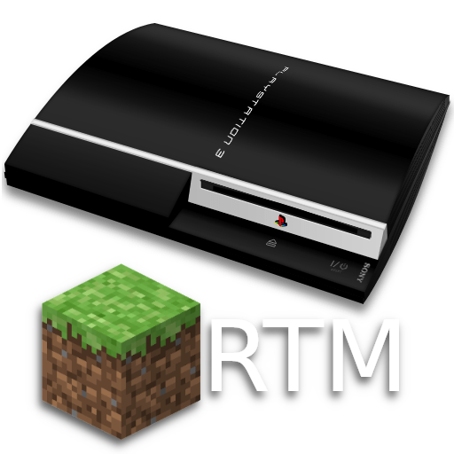
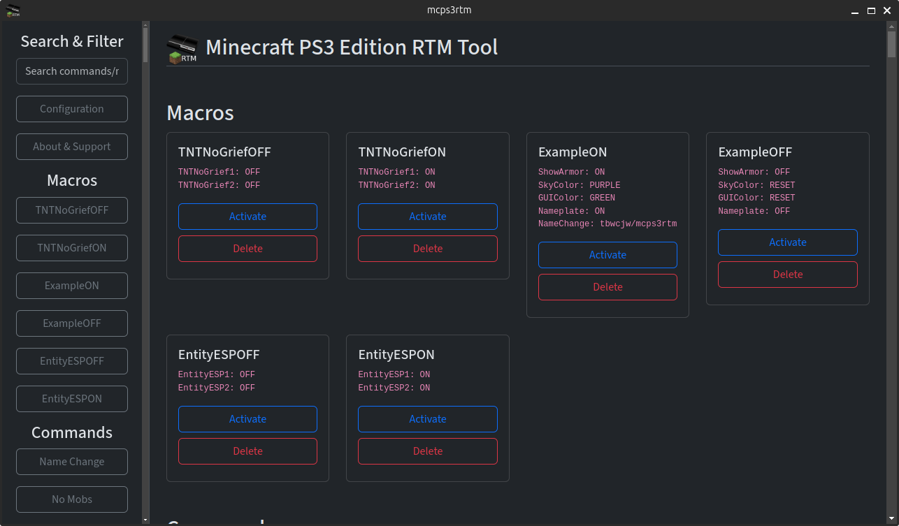
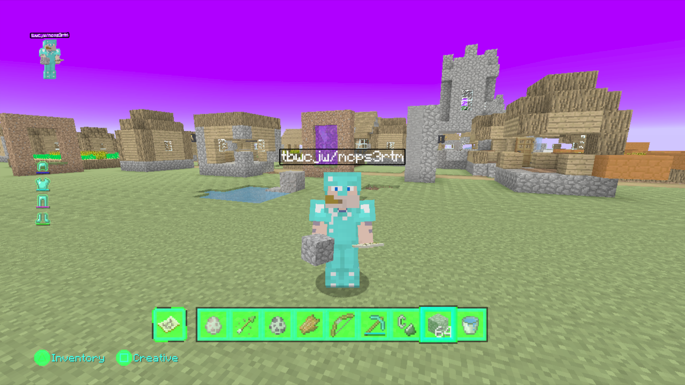

    

<h2 align="center">mcps3rtm - Minecraft PS3 Edition RTM Tool</h2>

A real time modding tool for the PS3 edition of Minecraft with <b>165</b> commands. Written in Python, with a Streamlit web app and desktop application.

Does not require a modified <code>EBOOT.bin</code> or any <code>.sprx</code> files.

<h3>Table of Contents</h3>
<ul>
    <li><a href='#requirements'>Requirements</li></a>
    <li><a href='#cli'>CLI Usage</a>
        <ul>
            <li>Options</li>
            <li>Simple Commands</li>
            <li>Flags</li>
            <li>Server/Desktop Mode</li>
        </ul>
    <li><a href='#installation'>Installation</a></li>
    </li>
    <li><a href='#macros'>Macros</a>
        <ul>
            <li>Creation</li>
            <li>Usage</li>
            <li>Deletion</li>
        </ul>
    </li>
    <li><a href='#troubleshooting'>Troubleshooting</li></a>
    <li><a href='#screenshots'>Screenshots</li></a>
    <li><a href='#credits'>Credits</li></a>
    <li><a href='#license'>License</li></a>
</ul>
<h2>Requirements</h2>
<ul>
<li>Python. Running <code>./mcps3rtm</code> will detect or create a virtual environment and install dependancies automatically.</li>
<li>A PS3 running CFW/Hen with the webMAN mod installed.</li>
<li>Enabled PS3MAPI server; in XMB/In-Game PAD Shortcuts settings of /setup.ps3. <a href='https://github.com/aldostools/webMAN-MOD/wiki/Web-Commands#ps3mapi-server-commands'>[?]</a>
</ul>

<h2>CLI Usage</h2>
<pre><code>./mcps3rtm cli --ip [-h] [--ip IP] [--force] [--clear-history] [--notify] 
               [--make-macro NAME COMMANDS] [--delete-macro NAME] [--macro NAME]
</code></pre>

<h4>Options</h4>
<ul>
<li><strong>-h, --help</strong>: Show help message and exit</li>
<li><strong>--ip IP, --host IP</strong>: IP address of the PS3 running Webman</li>
<li><strong>--force</strong>: Disables process validation checking</li>
<li><strong>--clear-history</strong>: Clear history file</li>
<li><strong>--notify</strong>: Display a notification on the PS3 each time a value is changed</li>
<li><strong>--make-macro NAME COMMANDS</strong>: Chain multiple commands and save a macro, usage: <code>--macro "MacroName" "Command VALUE, Command VALUE"</code></li>
<li><strong>--delete-macro NAME</strong>: Delete macro by name</li>
<li><strong>--macro NAME</strong>: Load a macro</li>
</ul>
<h4>Simple Commands</h4>
<pre><code>./mcps3rtm cli --ip x.x.x.x cli Command VALUE</code></pre>

A list of commands and values can be found <a href='OFFSETS.md'>here</a>.
<h4>IP Flag</h4>

Use <code>--ip</code> to set the PS3 IP. This can also be set in <code>config.yml</code> as <code>ps3.ip x.x.x.x</code>

<h4>Notify Flag</h4>

Use <code>--notify</code> to display notifications on the PS3 whenever a command is sent.

This can also be set in <code>config.yml</code> as <code>ps3.notify true|false</code>

<h4>Force Flag</h4>

Use <code>--force</code> to stop the application from validating that an EBOOT process is running.  
<b>Running with this flag can break PS3 system functionality.</b>
 

This can also be set in <code>config.yml</code> as <code>ps3.force true|false</code>

<h4>Server Mode</h4>

<pre><code>./mcps3rtm server</code></pre>

Launches the streamlit server, accessible via browser.

<h4>Desktop Mode</h4>

<pre><code>./mcps3rtm desktop</code></pre>

Launches a QT6 browser app and spawns a server process.

<h2>Installation</h2>

<pre><code>./mcps3rtm install</code></pre>

On linux this will create a .desktop entry, on windows a .bat file will be created, and a .lnk to the desktop. Both are shortcuts to the absolute path of the application. Launching this way will open into desktop mode.

<b>Notice</b>: This functionality has not yet been tested on Windows.

<h2>Macros</h2>

Chain together multiple commands to be run at once.

A simple way to "toggle" macros is to create two macros: <code>macroNameON</code> and <code>macroNameOFF</code> with opposite values.

Included are two example macros; <code>ExampleON</code>.

Also included are <code>ExampleOFF</code>, <code>EntityESPON, EntityESPOFF</code> and <code>TNTNoGriefON, TNTNoGriefOFF</code> for commands that have multiple parts.

<h3>Creation</h3>

<pre><code>./mcps3rtm cli --make-macro "macroName" "COMMAND VALUE, COMMAND VALUE"</code></pre>

Macro files are in CSV format, saved as <code>macroName.macro</code> in the <code>macros/</code> directory.

<h3>Usage</h3>

<pre><code>./mcps3rtm cli --macro macroName</code></pre>

Adding the <code>.macro</code> extension is not required.

<h3>Deletion</h3>

<pre><code>./mcps3rtm cli --delete-macro macroName</code></pre>

<h2>Troubleshooting</h2>

<b>Game or system crashing unexpectedly</b>: This tool was developed using the latest version of Minecraft. Ensure your game is up to date. Some commands are incompatible with each other and will crash the game.

<pre><code>bash: ./mcps3rtm: Permission denied OR
sudo: ./mcps3rtm: command not found
</code></pre>

The file <code>mcps3rtm</code> contains a python shebang. Ensure it has executable permissions <code>chmod +x mcps3rtm</code>. Alternatively, add the <code>.py</code> extension and run with <code>python3 mcps3rtm.py</code>.

<pre><code>Error
Port in use
Port XXXX is already in use</code></pre>

Change streamlit.port in config.yml or kill processes on port XXXX and relaunch.

<pre><code>THE RUNNING PROCESS IS NOT AN EBOOT. USE --force OR SET ps3.force TO IGNORE</code></pre>

mcps3rtm checks to make sure an eboot process is running. If it is not we throw an error. using --force or setting ps3.force to true in the config.yml will ignore this check. <b>Not Recommended</b>.

<pre><code>Failed to get the current process ID from the PS3. Is the PS3 online and the IP correct?</code></pre>

Either the PS3 is offline, the IP is incorrect, or you haven't enabled PS3MAPI in webMAN. Check these and try again.

<b>Ask for help and report bugs by creating an issue.</b>
<h2>Screenshots</h2>

<i>Desktop application</i>

<i>Minecraft with the "ExampleON" macro.</i>

<h2>Credits</h2>
<pre><code>PhoenixARC, TheBlackRabbit, Misakiii, 
MayhemModding, SkullModz, OhItzDiiTz, 
DublinModz, EternalModz, et al.</code></pre>

<h2>License</h3>

This software is licensed under the MIT license.

