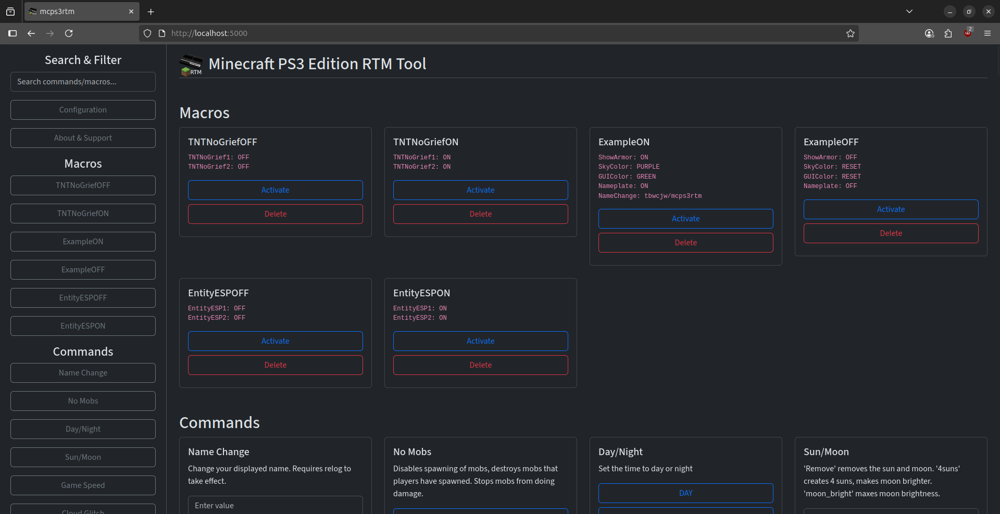

    

<h2 align="center">mcps3rtm - Minecraft PS3 Edition RTM Tool</h2>

A real time modding tool for the PS3 edition of Minecraft with 165 commands with web and desktop interfaces. Written in Python.

Does not require a modified <code>EBOOT.bin</code> or any <code>.sprx</code> files.

<h3>Table of Contents</h3>
<ul>
    <li><a href='#requirements'>Requirements</li></a>
    <li><a href='#usage'>Usage</a>
        <ul>
            <li>Options</li>
            <li>Simple Commands</li>
            <li>Flags</li>
        </ul>
    </li>
    <li><a href='#macros'>Macros</a>
        <ul>
            <li>Creation</li>
            <li>Usage</li>
            <li>Deletion</li>
        </ul>
    </li>
    <li><a href='#building'>Building</li></a>
    <li><a href='#troubleshooting'>Troubleshooting</li></a>
    <li><a href='#screenshots'>Screenshots</li></a>
    <li><a href='#credits'>Credits</li></a>
    <li><a href='#license'>License</li></a>
</ul>
<ul>
<li>Python.</li>
<li>A PS3 running CFW/Hen with the webMAN mod installed.</li>
<li>Enabled PS3MAPI server; in XMB/In-Game PAD Shortcuts settings of /setup.ps3. <a href='https://github.com/aldostools/webMAN-MOD/wiki/Web-Commands#ps3mapi-server-commands'>[?]</a>
</ul>

<h2>Usage</h2>
<pre><code>./mcps3rtm [-h] [--ip IP] [--force] [--clear-history] [--notify] [--server] [--desktop] [--make-macro NAME COMMANDS] [--delete-macro NAME] [--macro NAME]
</code></pre>

<h4>Options</h4>
<pre><code>-h, --help            show this help message and exit
--ip IP, --host IP    IP address of the PS3 running Webman
--force               Disables process validation checking
--clear-history       Clear history file
--notify              Display a notification on the PS3 each time a value is changed.
--make-macro NAME COMMANDS      Chain multiple commands, and save a macro, which can be loaded with `--macro file.csv`
--delete-macro NAME   Delete macro by name
--macro NAME          Load a macro 
--server [PORT]             Launch the web server
--desktop                   Launch the desktop application

[command] -h, --help to display valid values</code></pre>
<h3>Simple Commands</h3>
<pre><code>./mcps3rtm --ip x.x.x.x Command VALUE</code></pre>

A list of commands and values can be found <a href='OFFSETS.md'>here</a>.
<h4>IP Flag</h4>

Use <code>--ip</code> to set the PS3 IP. This can also be set in <code>config.yml</code> as <code>ps3.ip x.x.x.x</code>

<h3>Notify Flag</h3>

Use <code>--notify</code> to display notifications on the PS3 whenever a command is sent.

This can also be set in <code>config.yml</code> as <code>ps3.notify true|false</code>

<h3>Force Flag</h3>

Use <code>--force</code> to stop the application from validating that an EBOOT process is running.  
<b>Running with this flag can break PS3 system functionality.</b>
 

This can also be set in <code>config.yml</code> as <code>ps3.force true|false</code>

<h3>Server Flag</h3>

Use <code>--server</code> to launch the integrated Flask server, and serve the GUI app on the local network. Default port is 5000, set with <code>--server [PORT]</code> or in <code>config.yml</code> with
<code>server.port [PORT]</code>

<h3>Desktop Flag</h3>

Use <code>--desktop</code> to launch the integrated Qt6 desktop app, which in turn launches the integrated Flask server, and serve the GUI app, and on the local network too.

An example <code>.desktop</code> entry can be found <a href='https://gist.github.com/tbwcjw/10cb54ed76c76542a938e1abadf019bc'>here</a>.

<h2>Macros</h2>

<h3>Creation</h3>
<pre><code>./mcps3rtm --make-macro "macroName" "COMMAND VALUE, COMMAND VALUE"</code></pre>

Macro files are in CSV format, saved as <code>macroName.macro</code> in the <code>macros/</code> directory.

<h3>Usage</h3>

<pre><code>./mcps3rtm --macro macroName</code></pre>

Adding the <code>.macro</code> extension is not required.

<h3>Deletion</h3>

<pre><code>./mcps3rtm --delete-macro macroName</code></pre>

<h2>Building</h2>

For pyinstaller to run, you will need to create a virtual environment with
the packages from <code>requirements.txt</code> installed.

<code>make all</code> - builds, creates a release, then cleans up. 
<code>make release</code> - zips the created executable along with requisites. 
<code>make build</code> - builds the application into an executable. 
<code>make clean</code> - removes <code>__pycache__</code>, the <code>dist/</code> and <code>build/</code> directories, and the <code>*.spec</code> file pyinstaller creates. Will not remove the <code>release/</code> directory.

<h2>Troubleshooting</h2>

<b>Game or system crashing unexpectedly</b>: This tool was developed using the latest version of Minecraft. Ensure your game is up to date. Some commands are incompatible with each other and will crash the game.

<pre><code>Page did not load in time.
Perhaps the port is in use?</code></pre>

The desktop application failed to start the server on the port set in config.
Find the process using that port and exit it.

<pre><code>THE RUNNING PROCESS IS NOT AN EBOOT. USE --force OR SET ps3.force TO IGNORE</code></pre>

mcps3rtm checks to make sure an eboot process is running. If it is not we throw an error. using --force or setting ps3.force to true in the config.yml will ignore this check. <b>Not Recommended</b>.

<pre><code>Failed to get the current process ID from the PS3. Is the PS3 online and the IP correct?</code></pre>

Either the PS3 is offline, the IP is incorrect, or you haven't enabled PS3MAPI in webMAN. Check these and try again.

<b>Ask for help and report bugs by creating an issue.</b>
<h2>Screenshots</h2>

<i>Minecraft with the "ExampleON" macro.</i>

<i>mcps3rtm GUI in browser.</i>

<i>mcps3rtm GUI in Ubuntu.</i>

<h2>Credits</h2>
Addresses/offsets:
<pre><code>PhoenixARC, TheBlackRabbit, Misakiii, 
MayhemModding, SkullModz, OhItzDiiTz, 
DublinModz, EternalModz, et al.</code></pre>

<h2>License</h3>

This software is licensed under the MIT license.

